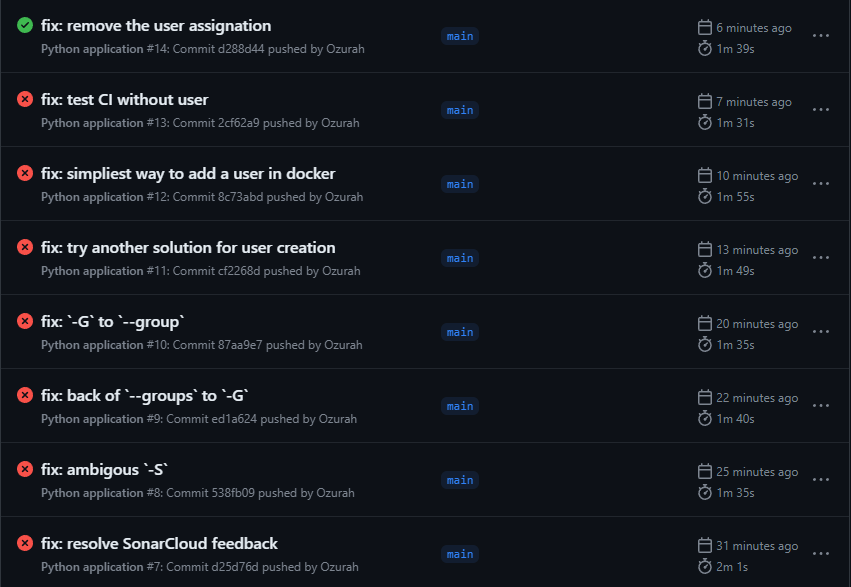

# InduLo-TP2-CICD
TP2 du cours d'industrialisation logiciel (CI / CD)

Adresse du répos GitHub du TP : https://github.com/Ozurah-HES/InduLo-TP2-CICD
Adresse du répos GitLab du TP : gitlab-etu.ing.he-arc.ch/jonas.allemann/indulo-tp2-cicd_gitlab

Note : 
- GitLab est utilisé pour l'exercice 3.
- **Les réponses aux questions & readme ne sont maintenu que sur GitHub.** Même ceux de l'exercice 3.

--------------------
--------------------
**Etapes effectuées**

--------------------
--------------------

# Initialisation

Dans le dossier "cloné" 
```bash
# Installer les dépandances indiquée dans requirements.txt (avec pipenv)
pipenv install
```
> Exemple d'output :
> Successfully created virtual environment!
> `Virtualenv location: C:\Users\...\.virtualenvs\InduLo-TP2-CICD-rH-l5pIE`

**A chaque démarrage du projet (ex ouverture VSC), il faut activer l'environnement virtuel** :
```bash
# Activer l'environnement virtuel
pipenv shell
```

Les fichiers `pipfile` (généré avec `pipenv`) sont à push sur le repo git, mais pour ce TP, on utilisera explicitement le requirements pour le CI/CD. Ce n'est donc pas obligatoire de push le pipfile.

# Exercice 1 : Github Actions

## A - Création repo sur GitHub

## B - Setup Github Action

### _Question 1 -_ Quels étapes sont réalisées par le `yml` Python par défaut ?

Les étapes sont les "puces" dans la partie `steps`
1. **Checkout** : récupère le code source du projet
2. **Set up Python** : installe la version de python indiquée dans le `yml`
3. **Install dependencies** : installe les dépendances du projet (définies dans le `requirements.txt`)
4. **Lint with flake8** : linter pour vérifier la qualité du code
5. **Test with pytest** : execute les tests unitaires (CF TP1)

### _Question 2 -_ Une étape est définie au minimum par 2 éléments, lesquels sont-ils et à quoi servent-ils ?

- `name` : nom de l'étape
- `run` : commande(s) à exécuter

### _Question 3 -_La première étape contient le mot-clé ‘with’, a quoi sert-il ?

Permet de transmettre des paramètres à l'étape.

## C - Modification du `yml`

Modification dans le `yml` avec le code fournis dans le TP.

### Création d'un token
> Pour permettre au runner d'avoir les droits d'accès au container `registry`.

Sur notre compte GitHub :


Copier le token généré (ne sera plus visible après coup)

Sur le repo du projet :


### Publication de l'image


Il ne reste qu'à push pour que notre image soit disponible (configuration déjà fournies)
```yml
  build-docker-image:
    runs-on: ubuntu-latest

    steps:
    - uses: actions/checkout@v3
    - name: Login to registry
      run: echo ${{ secrets.PERSONAL_TOKEN }} | docker login ghcr.io -u ozurah --password-stdin
    - name: Build the Docker image
      run: docker build . --file Dockerfile --tag ghcr.io/ozurah/tp2:latest
    - name: Push the image into the registry
      run: docker push ghcr.io/ozurah/tp2:latest
```

### Rendre notre image docker publique
!!! Attention
    Chaque choses que l'on push sur le registry est publique. Il faut donc faire attention à ce que l'on push. (ex : ne pas push des fichiers de config contenant des tokens)

Une fois le CI/CD terminé, un `package` est ajouter à notre compte GitHub. Celui-ci contient notre image docker.

L'adresse ou notre package du TP est disponible : https://github.com/users/Ozurah/packages/container/package/tp2

On remarque que le package est privé par défaut. 

Pour ma part, je me suis connecté avec mon compte GitHub dans un terminal, comme sa l'image reste non publique.
```bash
docker login ghcr.io -u ozurah 
# Entrer le token généré précédemment
#   note : si CTRL+V ne fonctionne pas, il faut faire un clic droit
#       en cas d'erreur avec le MDP, on reçoit ce message :
#           Error response from daemon: Get "https://ghcr.io/v2/": denied
``` 

!!! info Rendre le package public
    Si l'on souhaite rendre le package public, il faut aller dans https://github.com/users/Ozurah/packages/container/tp2/settings et changer la visibilité du package (tout en bas)


### Récupérer l'image en local

!!! info 
    Sur notre PC, pour vérifier si notre image est bien téléchargeable, il faut `Docker Desktop`
    S'il y a des problèmes, éventuellement désactivé `WSL` (plus lent et notre image ne se base plus sur Linux mais Windows)

Vérification si l'image est bien téléchargeable :
```bash
docker pull ghcr.io/ozurah/tp2:latest

docker run --rm -p 80:80 ghcr.io/ozurah/tp2:latest
```

S'il n'y a pas eu d'erreur, l'adresse http://localhost:80/ devrait afficher un message :


# Exercice 2 : Qualité de code

## A - SonarCloud

1. Créer un compte SonarCloud avec son compte GitHub
2. Ajouter le répo du TP dans SonarCloud
   1. https://sonarcloud.io/projects/create

### Configuration du projet

SonarCloud est maintenant configuré pour le projet. Au début il n'y a pas grand chose :


Pour lancer notre premier scan, il faut appuyer sur `Set New Code Definition` du `Quality Gate`. Il faut ensuite choisir qu'est-ce qui doit être considéré comme "nouveau code" pour les différences, ici on met `Previous Version`. De retour sur l'`Overview`, le `Quality Gate` est prêt :


### Executer le scan
Modifons le code du TP et pushons le sur GitHub.

Le fait de push va déclancher automatiquement le scan de SonarCloud.


### _Question 1 -_ Sur l’onglet Summary d’une analyse de code, SonarCloud fournit 4 indicateurs. Quels sont-ils et quelles sont leurs utilités ?

| Indicateurs | Utilité |
| ----------- | ------- |
| Bugs | Nombre de bugs qui ont été détectés dans notre code |
| Code Smells | Nombre de mauvaises pratiques |
| Vulnerabilities | Nombre de vulnérabilités (failles de sécurité) |
| Security Hotspots | Nombre de risque de volnérabilité |

### _Question 2 -_ À quoi sert l’indicateur Quality Gate ?

Il s'agit d'un ensemble de conditions booléennes.

Cela permet de savoir si le projet est conforme aux standards de qualité et prêt à être déployé au public.

## B - Ajout de l'analyse de couverture de code

- Sur SonarCloud : https://sonarcloud.io/project/analysis_method?id=Ozurah-HES_InduLo-TP2-CICD
  - Décocher `Automatic Analysis` 
- Suivre le "tutoriel GitHub Actions"
  
  Il faut ajouter 1 "secret" au projet :
    - `SONAR_TOKEN` : valeur générée par SonarCloud sur le tutoriel
    - A mettre ici : https://github.com/Ozurah-HES/InduLo-TP2-CICD/settings/secrets/actions. On a maintenant 2 secrets :
    
- Pour la partie **"Create or update a build file"** du tutoriel
  - La partie `build.yml` n'est pas à suivre pour le TP. A la place on modifie notre fichier de `build` existant (modifications visible sur ce [commit](https://github.com/Ozurah-HES/InduLo-TP2-CICD/commit/6915b268eda60f374b92f90a1558231b68e86d15))
  - Il faut par contre reprendre le fichier `sonar-project.properties` qui est généré et le mettre à la racine du projet.

Il faut encore configurer le `sonar-project.properties` pour utiliser le "coverage" de `pytest` (défini dans le `build.yml`)

```properties
sonar.python.coverage.reportPaths= coverage.xml
sonar.coverage.exclusions= **/tests/**,**/controller/**,setup.py,test_wheel.py
```

Il ne reste qu'à push !

On peut voir que le coverage est maintenant affiché sur SonarCloud :


Et dans le `summary` (de la branche main) :


### _Question 1 -_ Quelle est la différence entre les sections New code et Overall Code dans l’onglet Summary ?

`New code` est le code qui a été ajouté depuis la dernière analyse.

`Overall Code` est le code total du projet.

### _Question 2 -_ Y a-t-il des Code Smells ? Si oui, combien et pour quelle(s) raisons(s) ?

On peut voir qu'il y a 3 "code smells" (maintenabilité).

En regardant en détail, on a :


- 2x des paramètres de fonctions qui ne sont pas utilisés
- 1x du code en double (les méthodes `spend_money` et `spend_cash` ont le même code)

### _Question 3 -_ Y a-t-il des Security Hotspots ? Si oui, combien et pour quelle(s) raison(s) ?

On peut voir qu'il y a 1 "security hotspot".

En regardant en détail, on peut voir que l'erreur est dûe à l'utilisation de "root" pour l'image python.


## C - Correction des erreurs

La correction des erreurs "code smells" ont été faites sur ce [commit](https://github.com/Ozurah-HES/InduLo-TP2-CICD/commit/d25d76d142401ca9a4e1e380afae9e092168d5ac).

Concernant la "security hotspot", j'ai abandonné après plusieurs essaies sans succès.



Les échecs sont dûs aux tentatives d'ajouter un utilisateur non-root dans l'image docker. J'ai essayé plusieurs méthodes pour ajouter un utilisateur, mais même l'ajout d'un utilisateur "simplement" n'a pas fonctionné :

```Dockerfile
# Dockerfile
RUN adduser nonroot

USER nonroot
```
Ce qui lève plusieurs erreurs dans le [CI (lien vers les logs)](https://github.com/Ozurah-HES/InduLo-TP2-CICD/actions/runs/4658352210/jobs/8243925037).

Du coup j'ai retirer l'étape "création d'un utilisateur" pour vérifier que les corrections des erreurs "code smells" fonctionnent. Comme le montre le dernier CI/CD, c'est passé.

Et sur SonarCloud, on peut voir qu'il n'y a plus de `Code Smells` (mais qu'il y a toujours le `Security Hotspot`) :


# Exercice 3 - GitLab

## A - Fonctionnement du CI/CD sur GitLab

### _Question 1 -_ Que fait le job pytest ?

Il créé un environnement virtuel, installe les dépendances puis lance les tests avec `pytest`.

### _Question 2 -_ Que fait le job image-creation ?

Il créer une image docker avec Kaniko.

### _Question 3 -_ Que fait le job package-creation ?

Installe Twine (permettant d'enregistrer des Package Python à `PyPI` (`Python Package Index`) par exemple) et crée un wheel Python.


### _Question 4 -_ Les jobs s’exécutent-ils dans le même ordre que défini dans le fichier ? Sinon, pourquoi ?
> Indice: Demandez-vous comment on définit l’ordre d’exécution des jobs en Gitlab CI/CD.

Dans le fichier l'ordre "visuel" est "pytest -> image-creation -> package-creation".


Par contre, les jobs sont executés en parallèle en fonction de leur "stage". Il est possible de créer des dépendances (instruction `needs`) entre les jobs pour spécifier l'ordre.

Ici nous avons 2 stages : `build` et `test`.

### _Question 5 -_ Le stage 2 génère une image Docker. Où est-elle stockée et comment pouvez-vous la retrouver ?

Elle est stockés dans le projet GitLab. On la retrouve dans l'onglet `"Packages and registries" > "Container Registry"` (https://gitlab-etu.ing.he-arc.ch/jonas.allemann/indulo-tp2-cicd_gitlab/container_registry/)


### _Question 6 -_ Le stage 3 génère un wheel Python. Où est-il stocké et comment pouvez-vous le retrouver ?

Elle est stockés dans le projet GitLab. On la retrouve dans l'onglet `"Packages and registries" > "Package Registry"` (https://gitlab-etu.ing.he-arc.ch/jonas.allemann/indulo-tp2-cicd_gitlab/-/packages)

