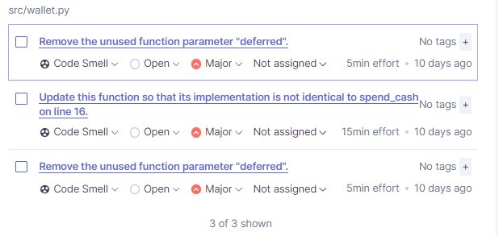
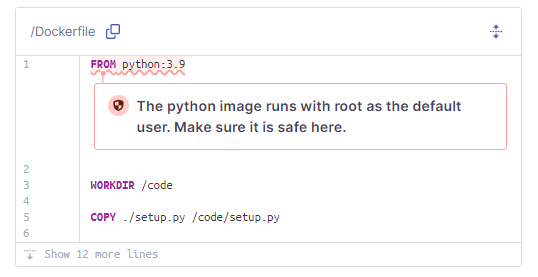
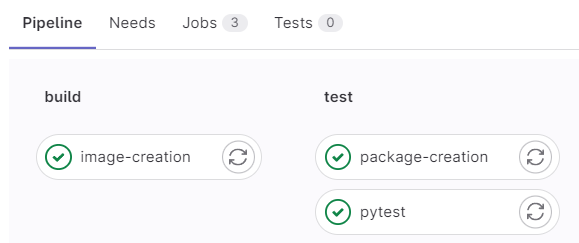
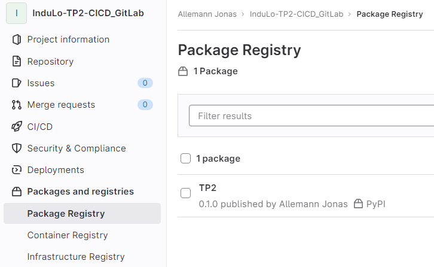

**Réponses aux questions**
> Elles sont également dans le fichier [README.md](README.md).
> Elles ont simplement été copiées ici pour les regroupées comme demandé dans la donnée.
> Les parties sans questions (exemple 1A) ne figurent pas ici.

# Exercice 1 : Github Actions

## Partie B - Setup Github Action

### _Question 1 -_ Quels étapes sont réalisées par le `yml` Python par défaut ?

Les étapes sont les "puces" dans la partie `steps`
1. **Checkout** : récupère le code source du projet
2. **Set up Python** : installe la version de python indiquée dans le `yml`
3. **Install dependencies** : installe les dépendances du projet (définies dans le `requirements.txt`)
4. **Lint with flake8** : linter pour vérifier la qualité du code
5. **Test with pytest** : execute les tests unitaires (CF TP1)

### _Question 2 -_ Une étape est définie au minimum par 2 éléments, lesquels sont-ils et à quoi servent-ils ?

- `name` : nom de l'étape
- `run` : commande(s) à exécuter

### _Question 3 -_La première étape contient le mot-clé ‘with’, a quoi sert-il ?

Permet de transmettre des paramètres à l'étape.

# Exercice 2 : Qualité de code

## A - SonarCloud

### _Question 1 -_ Sur l’onglet Summary d’une analyse de code, SonarCloud fournit 4 indicateurs. Quels sont-ils et quelles sont leurs utilités ?

| Indicateurs | Utilité |
| ----------- | ------- |
| Bugs | Nombre de bugs qui ont été détectés dans notre code |
| Code Smells | Nombre de mauvaises pratiques |
| Vulnerabilities | Nombre de vulnérabilités (failles de sécurité) |
| Security Hotspots | Nombre de risque de volnérabilité |

### _Question 2 -_ À quoi sert l’indicateur Quality Gate ?

Il s'agit d'un ensemble de conditions booléennes.

Cela permet de savoir si le projet est conforme aux standards de qualité et prêt à être déployé au public.

## B - Ajout de l'analyse de couverture de code

### _Question 1 -_ Quelle est la différence entre les sections New code et Overall Code dans l’onglet Summary ?

`New code` est le code qui a été ajouté depuis la dernière analyse.

`Overall Code` est le code total du projet.

### _Question 2 -_ Y a-t-il des Code Smells ? Si oui, combien et pour quelle(s) raisons(s) ?

On peut voir qu'il y a 3 "code smells" (maintenabilité).

En regardant en détail, on a :

- 2x des paramètres de fonctions qui ne sont pas utilisés
- 1x du code en double (les méthodes `spend_money` et `spend_cash` ont le même code)

### _Question 3 -_ Y a-t-il des Security Hotspots ? Si oui, combien et pour quelle(s) raison(s) ?

On peut voir qu'il y a 1 "security hotspot".

En regardant en détail, on peut voir que l'erreur est dûe à l'utilisation de "root" pour l'image python.

# Exercice 3 - GitLab

## A - Fonctionnement du CI/CD sur GitLab

### _Question 1 -_ Que fait le job pytest ?

Il créé un environnement virtuel, installe les dépendances puis lance les tests avec `pytest`.

### _Question 2 -_ Que fait le job image-creation ?

Il créer une image docker avec Kaniko.

### _Question 3 -_ Que fait le job package-creation ?

Installe Twine (permettant d'enregistrer des Package Python à `PyPI` (`Python Package Index`) par exemple) et crée un wheel Python.

### _Question 4 -_ Les jobs s’exécutent-ils dans le même ordre que défini dans le fichier ? Sinon, pourquoi ?
> Indice: Demandez-vous comment on définit l’ordre d’exécution des jobs en Gitlab CI/CD.

Dans le fichier l'ordre "visuel" est "pytest -> image-creation -> package-creation".

Par contre, les jobs sont executés en parallèle en fonction de leur "stage". Il est possible de créer des dépendances (instruction `needs`) entre les jobs pour spécifier l'ordre.

Ici nous avons 2 stages : `build` et `test`.

### _Question 5 -_ Le stage 2 génère une image Docker. Où est-elle stockée et comment pouvez-vous la retrouver ?

Elle est stockés dans le projet GitLab. On la retrouve dans l'onglet `"Packages and registries" > "Container Registry"` (https://gitlab-etu.ing.he-arc.ch/jonas.allemann/indulo-tp2-cicd_gitlab/container_registry/)

### _Question 6 -_ Le stage 3 génère un wheel Python. Où est-il stocké et comment pouvez-vous le retrouver ?

Elle est stockés dans le projet GitLab. On la retrouve dans l'onglet `"Packages and registries" > "Package Registry"` (https://gitlab-etu.ing.he-arc.ch/jonas.allemann/indulo-tp2-cicd_gitlab/-/packages)

